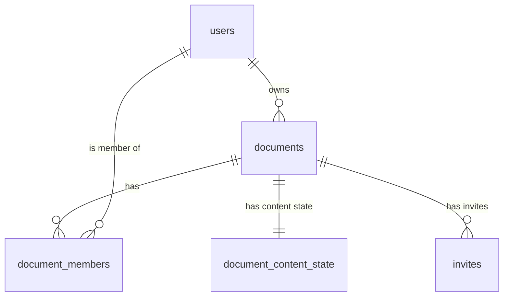

# Database & Data Architecture

Our application relies on **Supabase** (PostgreSQL) as the absolute source of truth. We designed a strict 5-table schema that minimizes data duplication, heavily enforces Row Level Security (RLS), and effortlessly integrates with our real-time collaboration engine.

Here is a deep dive into the architecture, the approach, and why these decisions make the system highly efficient.

---

## Schema Architecture Overview



---

## 1. `users` (Public Profiles & Triggers)

**The Problem:** Supabase Native Auth stores user credentials securely inside a hidden `auth.users` schema that our application cannot query. We need a public table for names and avatars.

**The Approach:** We created a `public.users` table. Instead of relying on our Next.js frontend to insert a row here after sign-up (which is prone to race conditions or network failures), we wrote a **PostgreSQL Trigger** (`handle_new_user`).

**Why it's efficient:** The millisecond a user registers in `auth.users`, the database automatically clones their metadata (name, avatar URL) into `public.users`. The frontend never runs an insert query, guaranteeing 100% data integrity with zero client-side logic. It is structurally impossible for an auth user to exist without a matching public profile — no race conditions, no forgotten insert calls across different auth paths (email, GitHub OAuth).

| Column | Type | Description |
|---|---|---|
| `id` | uuid (PK) | Foreign key referencing `auth.users.id` |
| `name` | text | Display name (from GitHub `full_name` or signup metadata) |
| `email` | text (unique) | User's email address |
| `image` | text | Profile picture URL (from GitHub avatar) |
| `created_at` | timestamptz | Account creation timestamp |

---

## 2. `documents` (Metadata & Soft Deletes)

Core document entity storing only metadata — intentionally thin. Separating metadata from content lets the Dashboard query titles and timestamps without pulling the potentially large Yjs binary.

| Column | Type | Description |
|---|---|---|
| `id` | uuid (PK) | Document identifier |
| `title` | text | Document title. Emoji icons are **prepended** to this string (no separate `icon` column) |
| `owner_id` | uuid (FK → users) | The document creator |
| `is_deleted` | boolean | Soft delete flag — deleted documents are hidden, not dropped |
| `created_at` | timestamptz | Creation timestamp |
| `updated_at` | timestamptz | Last modification timestamp |

**Design decisions:**
- **No `icon` column:** Emoji is prepended to the title string (`"📄 My Document"`), avoiding schema migration for a cosmetic feature.
- **Soft deletes:** `is_deleted = true` instead of `DELETE` — safety net for accidental deletions.
- **Separate from content:** Document metadata is stored here; the actual Yjs content lives in `document_content_state`. This lets the Dashboard query metadata without pulling potentially large binary content.

---

## 3. `document_members` (The Access Control List)

Maps users to documents with specific roles. This is the ultimate gatekeeper — all Server Actions (like `getDocumentById`) perform a `JOIN` on this table. If your user ID isn't linked to the document, the database returns `null`. This enforces security at the lowest possible level.

| Column | Type | Description |
|---|---|---|
| `id` | uuid (PK) | Row identifier |
| `document_id` | uuid (FK → documents) | The document |
| `user_id` | uuid (FK → users) | The member |
| `role` | text | `owner`, `editor`, or `viewer` (CHECK constraint) |
| `created_at` | timestamptz | Membership creation timestamp |

**Unique constraint:** `(document_id, user_id)` — a user can only have one role per document.

**Role enforcement throughout the app:**

| Element | Owner/Editor | Viewer |
|---|---|---|
| Rename document | ✅ | ❌ |
| Invite others | ✅ | ❌ |
| Formatting toolbar | ✅ | ❌ |
| Tiptap `editable` prop | `true` | `false` (engine-level lock) |

**Realtime integration:** A Supabase Realtime subscription on this table powers the "Access Revoked" modal — when a `DELETE` event fires for the current user, the editor shows a persistent modal instead of crashing.

---

## 4. `document_content_state` (CRDT & Real-Time Sync)

Stores the live collaborative text of the document. One row per document. We use **Yjs (CRDTs)** to ensure multiple users can type simultaneously without race conditions or data corruption.

| Column | Type | Description |
|---|---|---|
| `id` | uuid (PK) | Row identifier |
| `document_id` | uuid (FK → documents, UNIQUE) | The document this content belongs to |
| `ydoc_state` | text | Binary Yjs CRDT state encoded as **base64** |
| `preview_json` | jsonb | Lightweight Tiptap JSON snapshot for dashboard card previews |
| `updated_at` | timestamptz | Last persistence timestamp |

**This is the heart of real-time sync:**
- **Standalone Server:** Vercel serverless functions cannot handle persistent WebSockets. We run a standalone Node.js server (`hocuspocus-server`) using the lightning-fast `tsx` runtime.
- **Database Hooks:** The Hocuspocus server uses an `onStoreDocument` hook. Every few seconds, it encodes the binary Yjs state into base64 and performs a PostgreSQL `upsert` (`onConflict: 'document_id'`) into this table.
- `ydoc_state` stores the full CRDT binary — not just current content, but the entire operation history (including tombstoned deletions). This is what enables offline merge.
- **Preview JSON:** We also store a lightweight JSON snapshot here. Our dashboard uses `generateHTML(json, extensions)` to render beautiful, scaled-down A4 document preview thumbnails on the document cards, all without loading the heavy editor.
- Upsert uses `onConflict: 'document_id'` to avoid `INSERT` failures after the first save.

---

## 5. `invites` (Multi-Use Links & Email Tokens)

Manages document access provisioning via secure tokens. Supports two invite types in a single table.

| Column | Type | Description |
|---|---|---|
| `id` | uuid (PK) | Row identifier |
| `document_id` | uuid (FK → documents) | Target document |
| `email` | text (nullable) | **Non-null** = targeted email invite (single-use). **Null** = universal shareable link (multi-use) |
| `role` | text | `editor` or `viewer` — the permission granted on acceptance |
| `token` | text (unique) | `crypto.randomUUID()` string embedded in the invite URL |
| `status` | text | `pending`, `accepted`, or `rejected` (CHECK constraint) |
| `expires_at` | timestamptz | 24-hour TTL from creation |
| `created_at` | timestamptz | Audit timestamp |

**Design decisions:**
- **Two Invite Types:** If an invite has an `email` value, it is a single-use token that flips to `accepted` once used. If `email` is `null`, it acts as a "Universal Link" that stays `pending` and can be used by multiple team members (like sharing in Slack).
- **One table, two invite types:** Both flows answer the same question — "does this token grant access?" — so `acceptInvite(token)` only branches on the `email` column instead of querying two tables.
- **`expired` is NOT a stored status.** It is computed live: `expires_at < now()`. The database never writes "expired" — it's a pure function of time.
- **24-Hour Expiry:** Universal links are dangerous if they last forever. We enforce a strict 24-hour Time-to-Live (`expires_at`) on all invites to balance convenience with enterprise security.
- **Real-Time Revocation Sync:** Deleting an invite row does not emit the row's payload over Supabase Realtime (preventing the client from knowing *which* invite was revoked). To solve this, `revokeInviteAction` executes a two-step transaction: `UPDATE status = 'rejected'` (broadcasting the ID), immediately followed by `DELETE`. The frontend WebSocket listener catches the update event and seamlessly removes the invite from the Inbox UI without a page reload.
- **SendGrid Resilience:** When an owner sends bulk email invites, we execute a two-step process in `send-email-invites.action.ts`. **First**, we insert the invite rows into the database. **Second**, we trigger the SendGrid API. If SendGrid fails, the database row still exists, and the invite still appears instantly in the recipient's in-app `/inbox`. The database is the primary source of truth.

---

## 6. Storage Architecture: `document-assets`

To support rich text editing, we bypassed temporary Base64 strings in favor of true CDN-backed cloud storage.

- **The Bucket:** We created a public Supabase Storage bucket named `document-assets`.
- **Access:** Public reads (anonymous — `` tags work without auth headers), authenticated-only writes (RLS on `storage.objects`).
- **The Upload Flow:** When a user inserts an image in the editor, the client sends a `FormData` payload to a server action (`upload-image.action.ts`). The server validates the MIME type and 5MB size limit, generates a `crypto.randomUUID()`, and uploads the file to a structured path: `{documentId}/{uuid}.{ext}`.
- **Why it's efficient:** Grouping assets by `documentId` makes cleanup and data portability incredibly simple. Because the bucket is public, the Tiptap editor and exported PDFs can resolve the `` tags natively without needing to generate expiring signed URLs, ensuring the document always renders perfectly.
- **Why not `blob:` URLs?** `blob:` URLs are scoped to the browser tab that created them — other collaborators or page refreshes would show broken images.

---

## SQL Migration (V1)

```sql
-- Enable UUID extension
create extension if not exists "uuid-ossp";

-- 1. Users Table (Public Profile)
create table public.users (
  id uuid references auth.users(id) on delete cascade primary key,
  name text,
  email text unique not null,
  image text,
  created_at timestamptz not null default now()
);

-- Trigger: Auto-insert into public.users when a user signs up via Supabase Auth
create or replace function public.handle_new_user()
returns trigger as $$
begin
  insert into public.users (id, name, email, image)
  values (
    new.id,
    new.raw_user_meta_data->>'full_name',
    new.email,
    new.raw_user_meta_data->>'avatar_url'
  );
  return new;
end;
$$ language plpgsql security definer;

create trigger on_auth_user_created
  after insert on auth.users
  for each row execute procedure public.handle_new_user();

-- 2. Documents Table
create table public.documents (
  id uuid primary key default uuid_generate_v4(),
  title text not null default 'Untitled Document',
  owner_id uuid references public.users(id) on delete cascade not null,
  is_deleted boolean not null default false,
  created_at timestamptz not null default now(),
  updated_at timestamptz not null default now()
);

-- 3. Document Members Table
create table public.document_members (
  id uuid primary key default uuid_generate_v4(),
  document_id uuid references public.documents(id) on delete cascade not null,
  user_id uuid references public.users(id) on delete cascade not null,
  role text not null check (role in ('owner', 'editor', 'viewer')),
  created_at timestamptz not null default now(),
  unique(document_id, user_id)
);

-- 4. Document Content State Table
create table public.document_content_state (
  id uuid primary key default uuid_generate_v4(),
  document_id uuid references public.documents(id) on delete cascade not null unique,
  ydoc_state text,
  preview_json jsonb,
  updated_at timestamptz not null default now()
);

-- 5. Invites Table
create table public.invites (
  id uuid primary key default uuid_generate_v4(),
  document_id uuid references public.documents(id) on delete cascade not null,
  email text,
  role text not null check (role in ('editor', 'viewer')),
  token text unique not null default gen_random_uuid()::text,
  status text not null default 'pending' check (status in ('pending', 'accepted', 'rejected')),
  expires_at timestamptz,
  created_at timestamptz not null default now()
);

-- Indexes for performance
create index idx_docs_owner on public.documents(owner_id);
create index idx_members_user on public.document_members(user_id);
create index idx_members_doc on public.document_members(document_id);
create index idx_invites_doc on public.invites(document_id);
create index idx_invites_token on public.invites(token);
create index idx_invites_email on public.invites(email);
```

---

## Row Level Security (RLS)

Every table has RLS enabled. All queries are automatically scoped to the authenticated user's session. This is a second defense layer underneath the UI-level role checks — even if a UI bug let a viewer click a button they shouldn't see, the database query would still refuse to return or mutate unauthorized rows.

---

## What We Are Skipping (Intentionally)

To maintain MVP focus:
- Comments system
- Version history (snapshots)
- Folders / Workspaces
- Activity logs
- In-document chat

These can all be added later without breaking the core 5-table schema.

-- 6. Document Activity Table (Audit Log)
create table public.document_activity (
  id uuid primary key default uuid_generate_v4(),
  document_id uuid references public.documents(id) on delete cascade not null,
  actor_id uuid references public.users(id) on delete cascade not null,
  target_user_id uuid references public.users(id) on delete cascade,
  action_type text not null check (action_type in ('document_created', 'member_joined', 'member_removed', 'member_left', 'role_updated')),
  metadata jsonb,
  created_at timestamptz not null default now()
);
